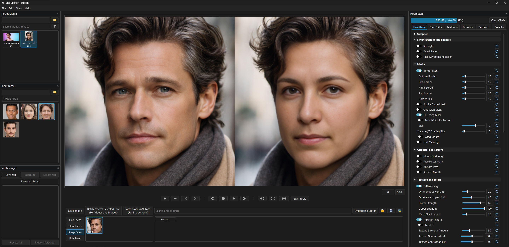

# VisoMaster Fusion

VisoMaster Fusion is a desktop application for AI-powered face swapping, enhancement, and editing on images, videos, and live webcam feeds. It combines a polished graphical workflow with advanced model controls, batch processing, VR180 support, and GPU-accelerated inference.

The project builds on the original VisoMaster work by **@argenspin** and **@Alucard24**, plus major contributions from the wider community.

---



*All faces shown in the screenshot are synthetic demo images used for illustration.*

> [!CAUTION]
> VisoMaster Fusion is only distributed through this repository.<br>
> Do not download or pay for VisoMaster / VisoMaster Fusion from third-party websites.<br>
> Sites like `visomaster.com` and `visomaster.org` are not affiliated with the maintainers.

## 🔗 Quick Links

- [Download Portable Launcher](https://github.com/VisoMasterFusion/VisoMaster-Fusion/releases/latest/download/Start_Portable.bat)
- [Quick Start Guide](./docs/quickstart.md)
- [User Manual](./docs/user_manual.md)
- [Join Discord](https://discord.gg/5rx4SQuDbp)

## 🚀 Quick Start

Most users should use the portable launcher:

1. Create a new folder where you want VisoMaster Fusion to live.
2. Download **only** `Start_Portable.bat` from latest release.
3. Put `Start_Portable.bat` in the new folder and run it.

The first launch downloads the portable runtime, dependencies, FFmpeg, and model files. After setup, always start VisoMaster Fusion with `Start_Portable.bat`.

## 🎛️ Feature Highlights

### 🧑 Face Swapping & Editing

- Multiple swapper models, including Inswapper128, InStyleSwapper variants, SimSwap, GhostFace, CSCS, and DeepFaceLive DFM models.
- Multi-face workflows with source face cards, saved embeddings, similarity thresholding, and optional ByteTrack tracking.
- Face likeness, keypoint replacement, face adjustment, expression editing, and pose/expression controls.
- Image, video, webcam, and virtual camera workflows.

### 🎨 Masks, Restoration & Enhancement

- Occlusion, XSeg, text, face parser, border, profile-angle, and mouth-focused mask controls.
- Face restorers, a second restorer pass, auto restore blending, GFPGAN-1024 support, and frame enhancers.
- ReF-LDM Denoiser with single-step and DDIM modes at multiple pipeline points.
- AutoColor, ending color transfer, texture transfer, differencing, MPEG artifact simulation, Restore Eyes, Restore Mouth, and Mouth Fit & Align.

### 🎬 Video, Jobs & Output

- Timeline markers for saving per-frame settings and record start/end segments.
- Issue scanning and dropped-frame review tools for checking render-sensitive frames before output.
- Job Manager for saving workspaces, loading jobs, and running batches unattended.
- Output controls for images, videos, multi-segment renders, audio handling, quality settings, and FFmpeg options.

### 🛠️ Launcher & Maintenance

- Portable launcher with update, repair, dependency check, model check, model optimization, model restore, launcher self-update, and version rollback tools.
- Providers include CUDA, TensorRT, TensorRT-Engine, and CPU, with TensorRT as the default.
- Built-in themes include True-Dark, OLED-Black, Windows11-Dark, Dark, Dark-Blue, Light, Solarized, Dracula, Nord, Gruvbox, and Monokai.

## 💻 System Requirements

- **Operating system:** Windows 10 or Windows 11, 64-bit
- **GPU:** Nvidia GPU recommended
- **VRAM:** 6 GB minimum for basic use; 8-12 GB or more recommended for heavier workflows
- **Driver:** Nvidia driver `>=576.57` recommended for CUDA 12.9 support
- **Internet:** Required on first run to download dependencies and models
- **Disk space:** 20-30 GB free space recommended

The app can run on CPU, but AI processing is much slower. Most users should use the portable version unless they specifically want a manual development setup.

## 📦 Installation

### 🚀 Portable Version

Download **only** the portable launcher from the release page:

- [Download - Start_Portable.bat](https://github.com/VisoMasterFusion/VisoMaster-Fusion/releases/latest/download/Start_Portable.bat)

Place it in a new folder and run it. The launcher installs everything into that folder, including Python 3.12, Git, FFmpeg, PyTorch, CUDA Toolkit , TensorRT, cuDNN, ONNX Runtime GPU, and the required model files.

**You do not need any of the non-portable steps below for the portable version.**

### 🧰 Non-Portable Installation

Use this path only if you want to manage the Python environment yourself.

**1. Clone the repository**

```sh
git clone https://github.com/VisoMasterFusion/VisoMaster-Fusion
cd VisoMaster-Fusion
```

Most users should use the `main` branch. The `dev` branch contains newer or in-progress changes.

**2. Create and activate a Python environment**

Using Anaconda:

```sh
conda create -n visomaster python=3.12 -y
conda activate visomaster
pip install uv
```

Using uv directly:

```sh
uv venv --python 3.12
.venv\Scripts\activate
```

**3. Install requirements**

```sh
uv pip install -r requirements_cu13.txt
```

**4. Download required models**

```sh
python download_models.py
```

**5. Install FFmpeg**

On Windows, either:

- Run: `winget install -e --id Gyan.FFmpeg --version 7.1.1`
- Or download https://www.gyan.dev/ffmpeg/builds/packages/ffmpeg-7.1.1-essentials_build.zip, unzip it, and add `\<unzipped ffmpeg path>\bin` to your Windows `PATH`

**6. Run the application**

Open `Start.bat` on Windows, or activate your environment in a terminal inside the `VisoMaster-Fusion` directory and run:

```sh
python main.py
```

To update a non-portable checkout:

```sh
git pull
uv pip install -r requirements_cu13.txt
python download_models.py
```

## 📖 More Documentation

- For a practical first-run guide, see [Quick Start Guide](./docs/quickstart.md).
- For detailed workflows, settings, and feature coverage, see [User Manual](./docs/user_manual.md).

## 🧪 Development

Please use pre-commit before `git add` and commit, and fix any issues it reports.

Future releases use PR label-based versioning based on Semantic Versioning.

```sh
uv pip install pre-commit
pre-commit run --all-files
```

### ✅ Unit Tests

The project has a test suite covering core pipeline logic such as VR math, face masks, face detectors, serialization, job validation, recording, scan tools, and widget logic. Tests run without a GPU and without Qt installed.

**Setup**

```sh
uv venv --python 3.12 .venv-test
.venv-test\Scripts\activate
uv pip install torch torchvision --index-url https://download.pytorch.org/whl/cu130
uv pip install numpy scipy scikit-image opencv-python pillow pytest pytest-mock
```

If you already have a `.venv` with the full `requirements_cu13.txt` installed, you can run tests directly in it.

**Run tests**

```sh
python -m pytest                     # run the full suite
python -m pytest tests/unit/         # unit tests only
python -m pytest tests/integration/  # integration tests only
python -m pytest -k "vr"             # filter by keyword
python -m pytest -v                  # verbose output
python -m pytest -vv                 # show each test
```

## 🩺 Troubleshooting

- If you see CUDA or provider errors, update your Nvidia driver and restart the app.
- If models are missing, run the launcher model check or `python download_models.py`.
- If portable setup fails partway through, run `Start_Portable.bat` again from the same folder.

## 💙 Support The Project

This project was made possible by the combined efforts of **[@argenspin](https://github.com/argenspin)** and **[@Alucard24](https://github.com/alucard24)**, with support from many other members of the Discord community. If you would like to support the continued development of **VisoMaster**, you can donate to either of us.

### 🙌 Mod Credits

VisoMaster-Fusion would not be possible without the incredible work of:

- **Job Manager Mod**: Axel (https://github.com/axel-devs/VisoMaster-Job-Manager)
- **Experimental Mod**: Hans (https://github.com/asdf31jsa/VisoMaster-Experimental)
- **VR180/Ref-ldm Mod**: Glat0s (https://github.com/Glat0s/VisoMaster/tree/dev-vr180)
- **Many Optimizations**: Nyny (https://github.com/Elricfae/VisoMaster---Modded)
- **Launcher**: Tenka (https://github.com/t3nka)

### argenspin

- [BuyMeACoffee](https://buymeacoffee.com/argenspin)
- BTC: bc1qe8y7z0lkjsw6ssnlyzsncw0f4swjgh58j9vrqm84gw2nscgvvs5s4fts8g
- ETH: 0x967a442FBd13617DE8d5fDC75234b2052122156B

### Alucard24

- [BuyMeACoffee](https://buymeacoffee.com/alucard_24)
- [PayPal](https://www.paypal.com/donate/?business=XJX2E5ZTMZUSQ&no_recurring=0&item_name=Support+us+with+a+donation!+Your+contribution+helps+us+continue+improving+and+providing+quality+content.+Thank+you!&currency_code=EUR)
- BTC: 15ny8vV3ChYsEuDta6VG3aKdT6Ra7duRAc

## ⚠️ Disclaimer

**VisoMaster** is a hobby project that we are making available to the community as a thank you to all of the contributors ahead of us. We've copied the disclaimer from Swap-Mukham here since it is well-written and applies 100% to this repo.

We would like to emphasize that our swapping software is intended for responsible and ethical use only. We must stress that users are solely responsible for their actions when using our software.

Intended Usage: This software is designed to assist users in creating realistic and entertaining content, such as movies, visual effects, virtual reality experiences, and other creative applications. We encourage users to explore these possibilities within the boundaries of legality, ethical considerations, and respect for others' privacy.

Ethical Guidelines: Users are expected to adhere to a set of ethical guidelines when using our software. These guidelines include, but are not limited to:

Not creating or sharing content that could harm, defame, or harass individuals. Obtaining proper consent and permissions from individuals featured in the content before using their likeness. Avoiding the use of this technology for deceptive purposes, including misinformation or malicious intent. Respecting and abiding by applicable laws, regulations, and copyright restrictions.

Privacy and Consent: Users are responsible for ensuring that they have the necessary permissions and consents from individuals whose likeness they intend to use in their creations. We strongly discourage the creation of content without explicit consent, particularly if it involves non-consensual or private content. It is essential to respect the privacy and dignity of all individuals involved.

Legal Considerations: Users must understand and comply with all relevant local, regional, and international laws pertaining to this technology. This includes laws related to privacy, defamation, intellectual property rights, and other relevant legislation. Users should consult legal professionals if they have any doubts regarding the legal implications of their creations.

Liability and Responsibility: We, as the creators and providers of the deep fake software, cannot be held responsible for the actions or consequences resulting from the usage of our software. Users assume full liability and responsibility for any misuse, unintended effects, or abusive behavior associated with the content they create.

By using this software, users acknowledge that they have read, understood, and agreed to abide by the above guidelines and disclaimers. We strongly encourage users to approach this technology with caution, integrity, and respect for the well-being and rights of others.

Remember, technology should be used to empower and inspire, not to harm or deceive. Let's strive for ethical and responsible use of deep fake technology for the betterment of society.
